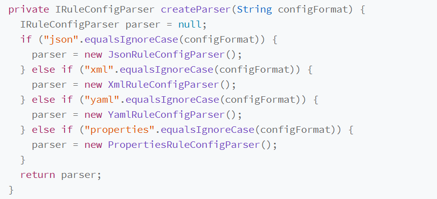

# 工厂模式 Factory Design Pattern

**分类：**

- 简单工厂

  ​	

  - 实现简单，存在较多的`if else`分支，适用于改动不多的方法
  - 剥离出一个独立的类，该类只负责对象的创建，这个类就是简单工厂类
  - 实现方法
    - 每次调用，创建一个新的对象
    - 实现创建好对象，使用时获取

- 工厂方法

  - 不只是简单的 new 一下就可以，而是要组合其他类对象，做各种初始化操作的时候，我们推荐使用工厂方法模式，将复杂的创建逻辑拆分到多个工厂类中，让每个工厂类都不至于过于复杂。
  - 在使用一个简单工厂，来创建工厂方法即可

- 抽象工厂

  - 让一个工厂负责创建多个不同类型的对象，而不是只创建一种

不只是简单的 new 一下就可以，而是要组合其他类对象，做各种初始化操作的时候，我们推荐使用工厂方法模式，将复杂的创建逻辑拆分到多个工厂类中，让每个工厂类都不至于过于复杂。

**是否使用：**

- 封装变化：创建逻辑有可能变化，封装成工厂类之后，创建逻辑的变更对调用者透明。
- 代码复用：创建代码抽离到独立的工厂类之后可以复用
- 隔离复杂性：封装复杂的创建逻辑，调用者无需了解如何创建对象
- 控制复杂度：将创建代码抽离出来，让原本的函数或类职责更单一，单吗更整洁

## DI容器--Dependency Injection Container依赖注入容器

- 相当于一个大的工厂类，负责在程序启动时，根据配置创建好对象，程序需要使用时，直接从容器中获取即可。
- 一个工厂类只负责创建某个类对象或者，欧一组相关类对象(继承自统一抽象类或者接口的子类)的创建，而DI容器负责整个应用中所有类对象的创建

**核心功能**

- 配置解析
- 对象创建
  - 设计工厂模式
  - 利用反射机制，动态加载和创建对象
- 对象生命周期管理
  - 区分单例对象和新创建的对象
  - 支持懒加载和配置对象的初始化和销毁方法

​	**如何实现一个简单的DI容器**

- 最小原型设计：支持简单的配置语法
- 提供执行入口：
- 配置文件解析
- 核心工厂类设计

